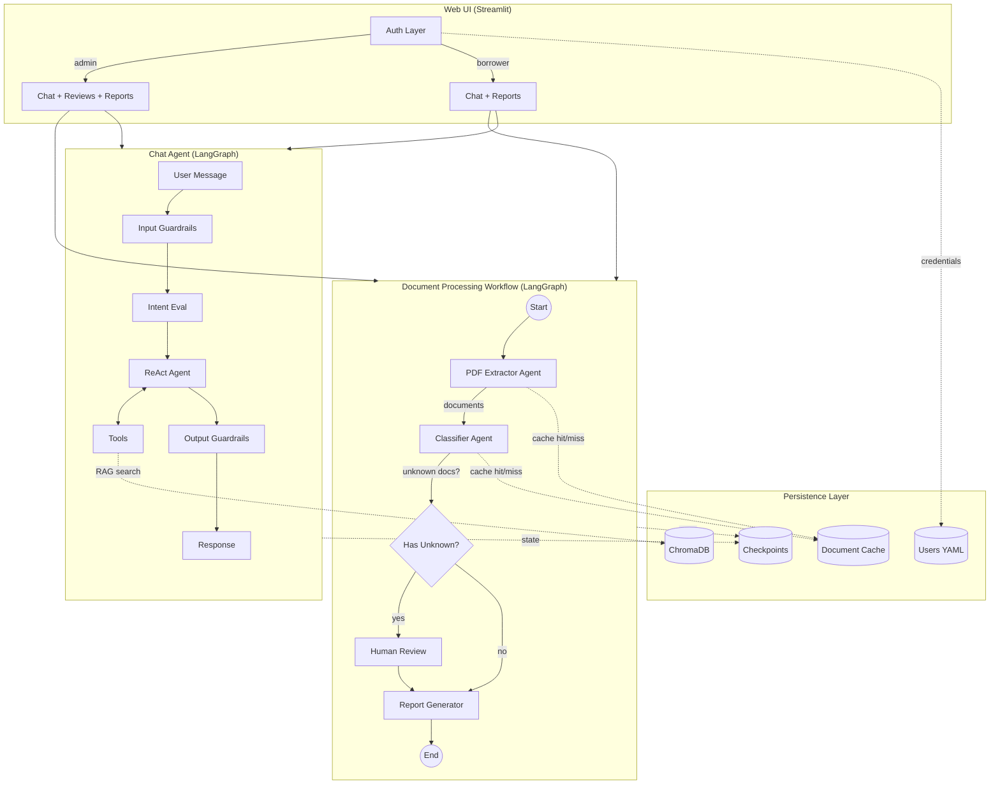
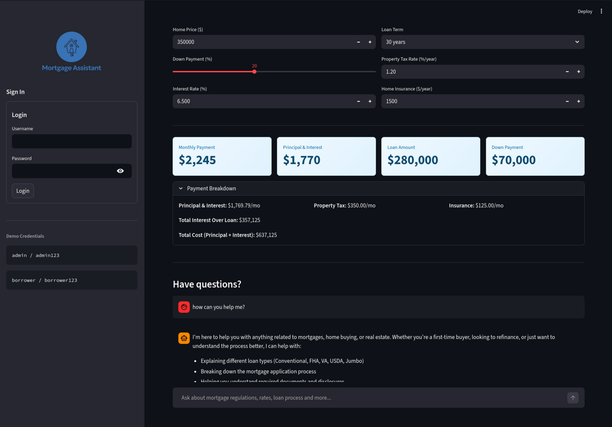
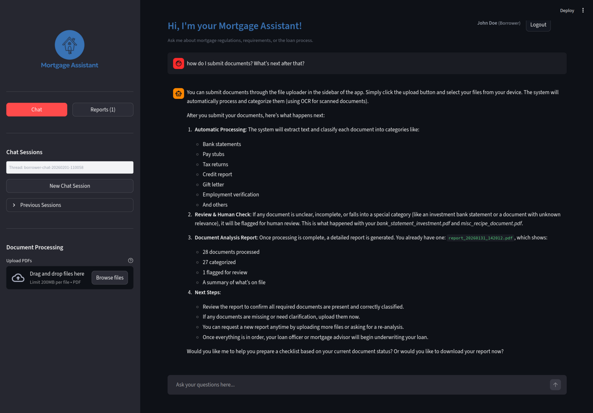
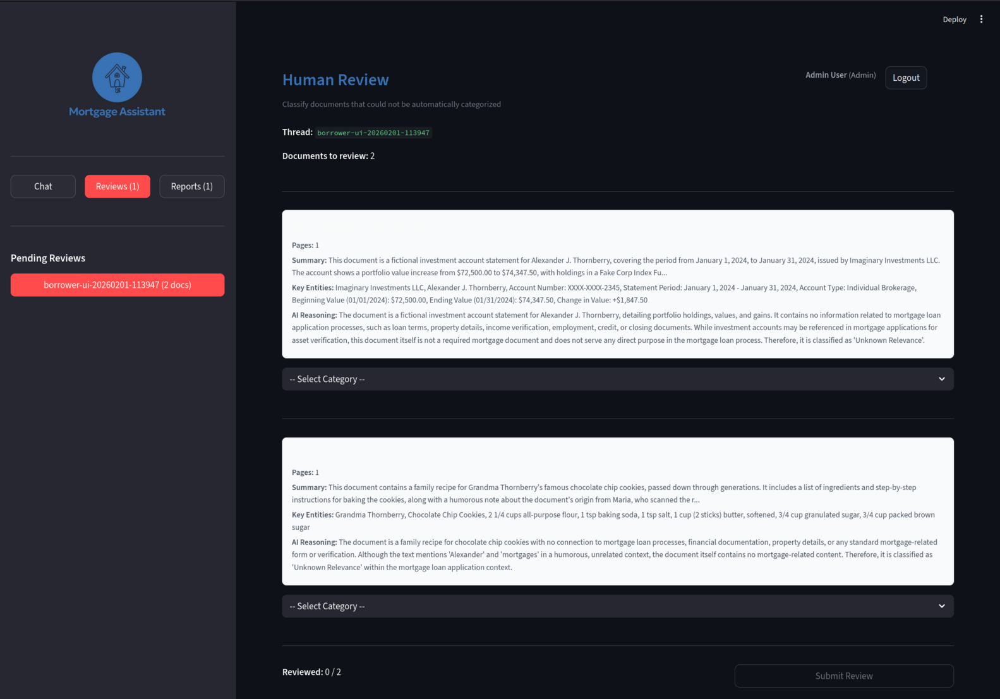
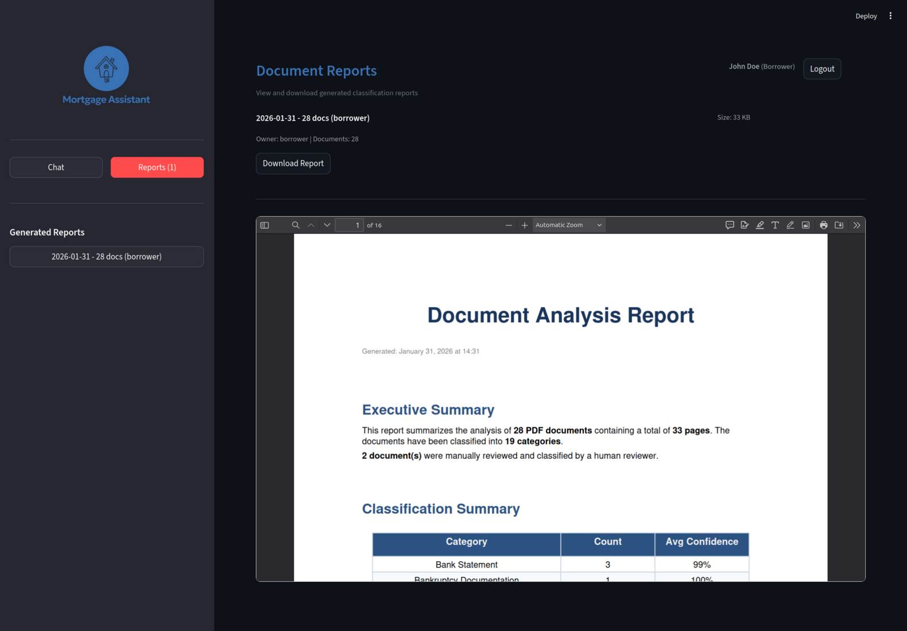

# Loan Processing with Agentic AI

Proof-of-Concept multiagent workflow using LangGraph to orchestrate document extraction, classification, and reporting with human-in-the-loop interactivity.

PDF documents go through a multi-step workflow designed for mortgage loan document classification. The workflow extracts content, classifies documents into mortgage-related categories, supports human-in-the-loop review for uncertain classifications, and generates a summary report.

> [!NOTE]
> This project was developed with assistance from AI tools.

## Architecture



## Components

| Component | Type | Description |
|-----------|------|-------------|
| **Document Workflow** | | |
| PDF Extractor | Agent | Extracts text from PDFs (with OCR fallback), generates summaries and key entities via LLM |
| Classifier | Agent | Categorizes documents into mortgage-related types with confidence scores |
| Human Review | Node | LangGraph interrupt-based review for uncertain classifications |
| Report Generator | Node | Produces PDF report summarizing all processed documents |
| **Chat System** | | |
| Chat Agent | Agent | LangGraph-based ReAct agent with tools for RAG, property lookup, web search, user memory |
| RAG Manager | Utility | ChromaDB vector store with HuggingFace embeddings for knowledge retrieval |
| User Memory | Utility | Persistent user facts (SQLite) + conversation recall (ChromaDB) |
| Guardrails | Utility | Defense-in-depth: input sanitization, PII detection, intent evaluation, output filtering |
| **Infrastructure** | | |
| Auth Layer | Utility | Role-based access control (admin/borrower) with session management |
| Document Cache | Utility | SQLite cache for LLM results, keyed by content hash |
| Checkpointer | Utility | SQLite-based state persistence for workflow resumability |
| LangFuse | Observability | Full traceability for all LLM calls, tool invocations, and guardrail events |
| OCR | Utility | docTR-based OCR with dynamic CPU/GPU selection |

## Prerequisites

- Python 3.11+
- OpenAI API key (or compatible endpoint)
- CUDA-capable GPU (optional, for faster OCR)

## Setup

```bash
# Create virtual environment
python -m venv venv
source venv/bin/activate  # Windows: venv\Scripts\activate

# Install dependencies
pip install -r requirements.txt
```

Configure environment variables:

```bash
cp .env.example .env
# Edit .env and add your OPENAI_API_KEY (required)
# See .env.example for all available options
```

### Sample Data

Generate fictional documents for testing:

```bash
# Sample mortgage documents (28 PDFs including 3 scanned for OCR testing)
python create_sample_pdfs.py

# Sample knowledge base (mortgage regulations)
python create_knowledge_base.py
```

## Usage

Start the web UI:

```bash
streamlit run frontend/app.py
```

### Landing Page

The landing page is available to all visitors (no login required):

- **Mortgage Calculator** - Calculate monthly payments with principal, interest, taxes, and insurance
- **Chat Assistant** - Ask general mortgage questions, search property data, or look up economic indicators

Anonymous chat has access to:
- Knowledge base search (mortgage regulations)
- Property lookup tools (if BatchData API configured)
- Web search (if Brave API configured)
- Economic data (if FRED API configured)

Anonymous sessions are traced but not persisted.



### Authentication

Log in to access full features:

| Role | Username | Password | Access |
|------|----------|----------|--------|
| Admin | `admin` | `admin123` | Full access: Chat, Reviews, Reports |
| Borrower | `borrower` | `borrower123` | Limited: Chat, Upload, Own Reports |

User credentials are stored in `config/users.yaml`.

### Chat Assistant

The authenticated chat assistant provides personalized help:

- **Knowledge Base** - Search mortgage regulations (TILA, RESPA, ECOA, etc.)
- **User Memory** - Remembers facts you share (loan type, timeline, etc.) across sessions
- **Conversation Recall** - Search past conversations for context
- **Document Tools** - Ask about your uploaded documents and reports
- **Property Lookup** - Verify addresses, get property details, search listings
- **Web Search** - Find current information (news, rates, etc.)
- **Economic Data** - Get mortgage rates, Fed funds rate, CPI, unemployment from FRED
- **Send Emails** - Offer email drafts for confirmation before sending to user's address

Previous chat sessions are listed in the sidebar for easy switching.

### Document Upload & Processing

In the sidebar:

1. **Upload PDFs** - Select one or more mortgage-related documents
2. **Process Documents** - Click to run the classification workflow:
   - Text extraction (OCR for scanned documents)
   - AI classification into mortgage categories
   - Results cached for fast re-processing
3. **View Results** - Check the Reports tab for your classification summary



### Human Review (Admin Only)

When documents are classified as "Unknown Relevance" or have low confidence:

1. Navigate to the **Reviews** tab
2. View document details (summary, entities, AI classification)
3. Select the correct category or confirm as unknown
4. Human-reviewed documents are marked in reports



### Reports

View generated reports in the **Reports** tab:

- Classification summary with document counts by category
- Individual document details with confidence scores
- Human review annotations where applicable
- Download reports as PDF

Borrowers see only their own reports; admins see all reports.



## Chat Agent Tools

The chat agent uses a ReAct architecture with dynamically available tools:

| Tool | Availability | Description |
|------|--------------|-------------|
| `search_knowledge_base` | When RAG ingested | Semantic search over mortgage regulations |
| `recall_past_conversations` | Authenticated | Search previous conversations for context |
| `get_my_stored_facts` | Authenticated | Retrieve remembered user facts |
| `get_my_reports` | Authenticated | List user's document reports |
| `get_my_documents` | Authenticated | List user's processed documents |
| `prepare_report_download` | Authenticated | Prepare a report for download |
| `verify_property_address` | When `BATCHDATA_API_KEY` set | USPS address verification |
| `get_property_details` | When `BATCHDATA_API_KEY` set | Property details, valuation, history |
| `search_properties` | When `BATCHDATA_API_KEY` set | Search properties by criteria |
| `geocode_address` | When `BATCHDATA_API_KEY` set | Convert address to coordinates |
| `web_search` | When `BRAVE_SEARCH_API_KEY` set | Web search for current information |
| `fred_get_series` | When `FRED_API_KEY` set | Get economic data series (rates, CPI, etc.) |
| `fred_search_series` | When `FRED_API_KEY` set | Search for FRED data series |
| `fred_mortgage_rates` | When `FRED_API_KEY` set | Get current 30/15-year mortgage rates |
| `draft_email` | Authenticated + `MAILEROO_SEND_KEY` | Draft email to user (requires confirmation) |

## Guardrails

Defense-in-depth security for the chat agent:

| Layer | Type | Description |
|-------|------|-------------|
| **Layer 1: Input** | Deterministic | Sanitization, PII detection/masking, domain classification |
| **Layer 2: Intent** | LLM-based | Detects jailbreaks, prompt injection, social engineering |
| **Layer 3: Output** | Deterministic | System prompt leak detection, PII filtering |

Guardrails run as LangGraph nodes, visible in traces. Configure via environment variables.

## Observability (LangFuse)

All LLM calls, tool invocations, and guardrail events are traced when LangFuse is configured:

```bash
# Add to .env
LANGFUSE_SECRET_KEY=sk-lf-...
LANGFUSE_PUBLIC_KEY=pk-lf-...
LANGFUSE_HOST=https://cloud.langfuse.com  # or self-hosted
```

Traces include:
- Chat agent conversations (per user session)
- Document processing workflows (extraction, classification)
- Tool calls with inputs/outputs
- Guardrail decisions (blocked/allowed)
- Token usage and latency metrics

View traces at [cloud.langfuse.com](https://cloud.langfuse.com) or your self-hosted instance.

## Data Isolation

- Upload directories are scoped by username: `uploads/{username}/batch-{timestamp}/`
- Workflow thread IDs include username prefix: `{username}-ui-{timestamp}`
- Chat sessions are user-specific: `{username}-chat-{timestamp}`

## CLI Reference

The CLI provides utilities for maintenance, debugging, and batch processing.

### Document Processing

```bash
python main.py [OPTIONS]

Options:
  -i, --input-dir PATH      Input directory containing PDFs (default: ./input_pdfs)
  -o, --output-dir PATH     Output directory for reports (default: ./output_reports)
  -l, --limit N             Process only first N documents
  --thread-id ID            Resume a specific workflow (auto-resumes if checkpoint exists)
  --no-checkpointing        Disable state checkpointing
  --session-id ID           Session ID for LangFuse tracking
```

### Cache Management

```bash
python main.py --cache-stats       # View cache statistics
python main.py --clear-cache       # Clear document extraction/classification cache
python main.py --no-cache          # Disable caching for this run
```

### Knowledge Base (RAG)

```bash
python main.py --ingest-knowledge      # Ingest PDFs from knowledge_base/
python main.py --knowledge-stats       # View knowledge base statistics
python main.py --clear-knowledge       # Clear the knowledge base
python main.py --knowledge-dir PATH    # Use custom knowledge base directory
```

### Chat & Memory

```bash
python main.py --chat-stats            # View chat session statistics
python main.py --clear-chat-history    # Clear all chat history
python main.py --memory-stats          # View user memory statistics
python main.py --clear-memory          # Clear user facts and conversation memory
python main.py --user USERNAME         # Scope memory operations to specific user
```

### Adding Users

```bash
# Generate password hash for new user
python -c "import streamlit_authenticator as stauth; print(stauth.Hasher().hash('your_password'))"
```

Add the hashed password to `config/users.yaml`.
