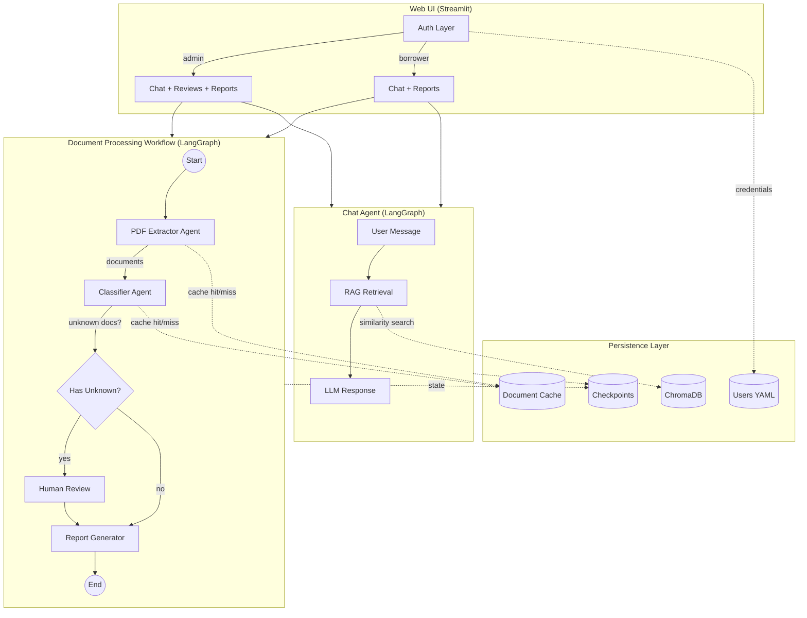

# Multiagent PDF Processing Workflow

Proof-of-Concept multiagent workflow using LangGraph to orchestrate document extraction, classification, and reporting with human-in-the-loop interactivity.

> [!NOTE]
> This project was developed with assistance from AI tools.

## Overview

PDF documents go through a multi-step workflow designed for mortgage loan document classification. The workflow extracts content, classifies documents into mortgage-related categories, supports human-in-the-loop review for uncertain classifications, and generates a summary report.

### Architecture



### Components

| Component | Type | Description |
|-----------|------|-------------|
| **Document Workflow** | | |
| PDF Extractor | Agent | Extracts text from PDFs (with OCR fallback), generates summaries and key entities via LLM |
| Classifier | Agent | Categorizes documents into mortgage-related types with confidence scores |
| Human Review | Node | LangGraph interrupt-based review for uncertain classifications |
| Report Generator | Node | Produces PDF report summarizing all processed documents |
| **Chat System** | | |
| Chat Agent | Agent | LangGraph-based conversational agent with optional RAG |
| RAG Manager | Utility | ChromaDB vector store with HuggingFace embeddings for knowledge retrieval |
| **Infrastructure** | | |
| Auth Layer | Utility | Role-based access control (admin/borrower) with session management |
| Document Cache | Utility | SQLite cache for LLM results, keyed by content hash |
| Checkpointer | Utility | SQLite-based state persistence for workflow resumability |
| OCR | Utility | docTR-based OCR with dynamic CPU/GPU selection |

## Installation

### Prerequisites

- Python 3.11+
- OpenAI API key (or compatible endpoint)
- CUDA-capable GPU (optional, for faster OCR)

### Setup

```bash
# Create virtual environment
python -m venv venv
source venv/bin/activate  # Windows: venv\Scripts\activate

# Install dependencies
pip install -r requirements.txt
```

Create a `.env` file in the project root:

```env
# Required
OPENAI_API_KEY=sk-...

# Optional - Custom OpenAI-compatible endpoint
OPENAI_BASE_URL=https://api.openai.com/v1
OPENAI_MODEL=gpt-4o-mini

# Optional - LangFuse observability
LANGFUSE_PUBLIC_KEY=pk-...
LANGFUSE_SECRET_KEY=sk-...
LANGFUSE_HOST=https://cloud.langfuse.com

# Optional - OCR settings
OCR_ENABLED=true
OCR_MIN_CHARS_PER_PAGE=50
OCR_MIN_FREE_VRAM_GB=3.0

# Optional - RAG settings
RAG_EMBEDDING_MODEL=sentence-transformers/all-MiniLM-L6-v2
```

## Usage

### Sample Data

Generate fictional document input set for testing:

```bash
python create_sample_pdfs.py
```

Creates 28 sample PDFs in `input_pdfs/`:
- 25 machine-generated PDFs covering all document categories
- 3 image-based PDFs (scanned documents) for OCR testing

File names are omitted from classification context to better test model capabilities, but can be reintroduced for more realistic scenarios.

### Basic Usage

```bash
# Place PDFs in input_pdfs/ directory, then:
python main.py

# Output report generated in output_reports/
```

### CLI Options

```bash
python main.py [OPTIONS]

Options:
  -i, --input-dir PATH      Input directory containing PDFs (default: ./input_pdfs)
  -o, --output-dir PATH     Output directory for reports (default: ./output_reports)
  -l, --limit N             Process only first N documents (default: all)
  --thread-id ID            Thread ID for checkpointing (auto-resumes if checkpoint exists)
  --no-checkpointing        Disable state checkpointing (disables resume capability)
  --session-id ID           Session ID for LangFuse tracking

Cache options:
  --cache-stats             Display cache statistics and exit
  --clear-cache             Clear document cache before processing
  --no-cache                Disable caching for this run
```

### Resuming Interrupted Workflows

Workflows are automatically checkpointed to SQLite. If interrupted, resume by passing the same thread ID:

```bash
# Initial run displays thread ID
python main.py
# Thread ID: doc-20260131-071500

# Resume later (auto-detects existing checkpoint)
python main.py --thread-id doc-20260131-071500
```

## Human-in-the-Loop Review

When documents are classified as "Unknown Relevance", the workflow prompts for manual review:

```
HUMAN REVIEW: Unknown Relevance Documents
--------------------------------------------------
Document: misc_document.pdf
Pages: 2
Summary: A document containing...
Key Entities: ...

Select category (1-18, or 0 to skip): 
```

Options:
- Select a category number to reclassify
- Confirm as "Unknown Relevance" (irrelevant to mortgage)
- Skip to keep AI classification

Human-reviewed documents are marked in the final report with their original AI classification noted.

## Knowledge Base (RAG)

The chat assistant can use Retrieval-Augmented Generation (RAG) to answer questions about mortgage regulations.

### Setup

```bash
# Generate sample regulation PDFs
python create_knowledge_base.py

# Ingest into vector store
python main.py --ingest-knowledge
```

### RAG CLI Options

```bash
python main.py [RAG OPTIONS]

Options:
  --ingest-knowledge      Ingest PDFs from knowledge_base/ into vector store
  --knowledge-stats       Display knowledge base statistics
  --clear-knowledge       Clear the knowledge base
  --knowledge-dir PATH    Custom knowledge base directory
```

## Web UI

A Streamlit-based interface with role-based access control.

```bash
streamlit run frontend/app.py
```

### Authentication

The UI requires login with one of two roles:

| Role | Username | Password | Access |
|------|----------|----------|--------|
| Admin | `admin` | `admin123` | Full access: Chat, Reviews, Reports |
| Borrower | `borrower` | `borrower123` | Limited: Chat, Upload, Own Reports |

User credentials are stored in `config/users.yaml`. To add users or change passwords:

```bash
# Generate password hash
python -c "import streamlit_authenticator as stauth; print(stauth.Hasher().hash('your_password'))"
```

### Views by Role

| View | Borrower | Admin |
|------|----------|-------|
| **Chat** | Ask questions, toggle RAG | Same |
| **Document Upload** | Upload and process PDFs | Same |
| **Reviews** | No access | Classify unknown documents |
| **Reports** | View own reports | View all reports |

### Data Isolation

- Upload directories are scoped by username: `uploads/{username}/batch-{timestamp}/`
- Workflow thread IDs include username prefix: `{username}-ui-{timestamp}`
- Chat sessions are user-specific: `{username}-chat-{timestamp}`
